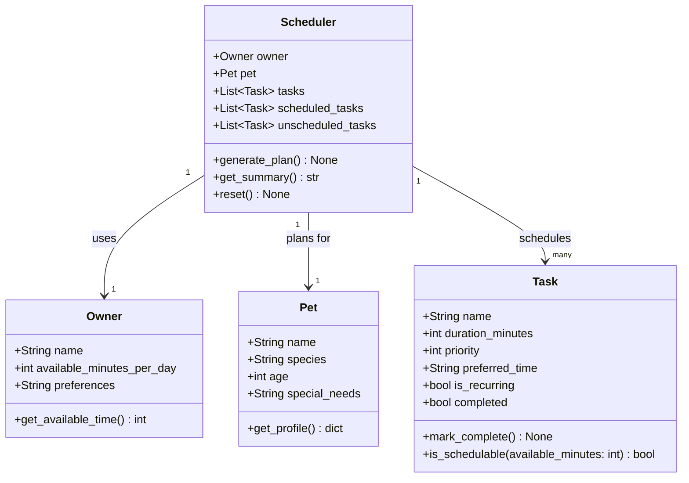

```mermaid
classDiagram
    class Owner {
        +String name
        +int available_minutes_per_day
        +String preferences
        +get_available_time() int
    }

    class Pet {
        +String name
        +String species
        +int age
        +String special_needs
        +get_profile() dict
    }

    class Task {
        +String name
        +int duration_minutes
        +int priority
        +String preferred_time
        +bool is_recurring
        +bool completed
        +mark_complete() None
        +is_schedulable(available_minutes: int) bool
    }

    class Scheduler {
        +Owner owner
        +Pet pet
        +List~Task~ tasks
        +List~Task~ scheduled_tasks
        +List~Task~ unscheduled_tasks
        +generate_plan() None
        +get_summary() str
        +reset() None
    }

    Scheduler "1" --> "1" Owner : uses
    Scheduler "1" --> "1" Pet : plans for
    Scheduler "1" --> "many" Task : schedules
```